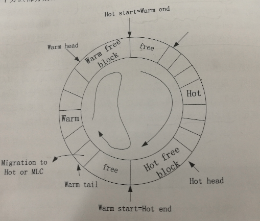

# CombFTL
## 1.关于CombFTL算法的数据分配机制
CombFTL的数据分配机制是基于请求大小的热数据识别的思想，其根据每个周期内冷数据的迁移量来调整热数据识别的阈值th的大小，**th的值主要固定在的几个值**之间进行切换。具体来说，CombFTL将阈值th的调整周期设置为SLC区域的容量大小，也就是说，每当接收到与SLC区域容量相当的数量的写请求时，阈值th进行一次调整，而阈值th的自适应调整则根据SLC区域往MLC区域的冷数据迁移率**v**来进行的。**v**表示SLC往MLC区域的数据迁移量与SLC区域容量的比值，**S**表示SLC区域的容量大小，**M**表示SLC往MLC的数据量，则v的定义为v=M/S,初始值设为10%，为了保持阈值th的稳定，如果SLC往MLC的冷数据迁移率大于v+n，则减小th，使更少的数据被分配到SLC中去，从而达到减小**v**的目的，如果SLC往MLC的冷数据迁移率小于v-n，则增大阈值th。使更多的数据被分配到SLC中，从而增大**v**的目的。n是一个比例系数，初始值未5%.
## 1.1数据分配机制对应的代码实现细节：
**涉及的函数**
1. static ioreq_event * iotrace_ascii_get_ioreq_event_0 (FILE *tracefile, ioreq_event *new)（预热前调用，固定阈值区分）
2. static ioreq_event * iotrace_ascii_get_ioreq_event_1 (FILE *tracefile, ioreq_event *new)

函数位于`disksim_iotrace.c`中，这里着重注释第二个函数，是函数预热后仿真采用的变化阈值
```cpp

static ioreq_event * iotrace_ascii_get_ioreq_event_1 (FILE *tracefile, ioreq_event *new)
{
   char line[201];

   //th_list就是论文确定的变动的几个固定阈值
   int th_list[5]={2,4,8,16,32};
   int th,sbcount,mbcount,threhold,diff,Es,Em,sblkno;
   _u32 RWs,RWm;
   int cnt,i,j,ppn;
   double ratio;
   sect_t s_psn,s_psn1,s_lsn;
   blk_t pbn,pin;
   if (fgets(line, 200, tracefile) == NULL) {
      addtoextraq((event *) new);
      return(NULL);
   }
   if (sscanf(line, "%lf %d %d %d %x\n", &new->time, &new->devno, &new->blkno, &new->bcount, &new->flags) != 5) {
      fprintf(stderr, "Wrong number of arguments for I/O trace event type\n");
      fprintf(stderr, "line: %s", line);
      ddbg_assert(0);
   }

   //flashsim
   RWs=SLC_stat_erase_num/41960;
   RWm=MLC_stat_erase_num/4096;
  
   diff=abs(RWs-RWm);
   Es=SLC_stat_erase_num%40960;
   Em=MLC_stat_erase_num%4096;
   threhold=abs(Es-Em);
   
  if(new->flags==0){ 
     printf("SLC磨损速度：%d\n",SLC_stat_erase_num);
     printf("MLC磨损速度：%d\n",MLC_stat_erase_num);
     //SLC(1048544扇区转化为)页为261632(512MB)
     if(SLC_write_page_count>=SLC_base_page_num){
        ratio=(double)migration_count/SLC_write_page_count;
        printf("ratio=%f\n",ratio);
        migration_count=0;
        //到达累计周期重置为0，在callFsim会接受重新统计写入SLC的次数
        SLC_write_page_count=0;
        //下面就根据保持阈值稳定th,以0.1上下0.05选择阈值，定档位
        if(ratio>0.15){
           if(INCRECEMENT==0)
              INCRECEMENT==0;
           else
              INCRECEMENT--;
        }else if(ratio<0.05){
           INCRECEMENT++;
           if(INCRECEMENT==5)
              INCRECEMENT=4;
        }else{
           INCRECEMENT+=0;
        }
     }
     th=th_list[INCRECEMENT];
     printf("th=%d\n",th);
     //2k页对齐方式
     sblkno=new->blkno;
     sbcount=((new->blkno+ new->bcount-1)/4 - (new->blkno)/4 + 1) * 4;
     sblkno /= 4;
     sblkno *= 4;
     cnt= (sblkno+ sbcount-1)/4 - (sblkno)/4 + 1;
      //根据阈值大小决定是否写入到SLC中（flash_op_flag=0）
     //写入到SLC的blkno要减去SLC的大小1048544基数和写死的total_SLC_util_sect_num  1048576
     //差了32 为了方便修改换成SLC_base_add定义在文件的头部
     if(cnt<=th){
        if(new->blkno>=SLC_base_add){
           new->blkno=new->blkno-SLC_base_add;
        }
        new->flash_op_flag=0;
        new->bcount=((new->blkno+ new->bcount-1)/4 - (new->blkno)/4 + 1) * 4;
        new->blkno /= 4;
        new->blkno *= 4;
        new->region_flag=0;
     }else{
        new->flash_op_flag=1;
        new->bcount = ((new->blkno+ new->bcount-1)/8 - (new->blkno)/8 + 1) * 8;
        new->blkno /= 8;
        new->blkno *= 8;
        new->region_flag=0;
     }
  }else{
      //如果new-operation为非0则是读请求，直接交给MLC
     new->region_flag=0;
     new->flash_op_flag=1;
     new->bcount = ((new->blkno+ new->bcount-1)/8 - (new->blkno)/8 + 1) * 8;
     new->blkno /= 8;
     new->blkno *= 8;
  }

   //req数据其他操作代码

  if (new->flags & ASYNCHRONOUS) {
     new->flags |= (new->flags & READ) ? TIME_LIMITED : 0;
   } else if (new->flags & SYNCHRONOUS) {
     new->flags |= TIME_CRITICAL;
   }
   new->buf = 0;
   new->opid = 0;
   new->busno = 0;
   new->cause = 0;
   return(new);
}
```
## CombFTL的数据迁移机制
CombFTL与CFTL一样将SLC区域当做循环队列使用，但与CFTL不同的是，CombFTL为了克服CFTL中的缺陷，防止热数据可能过早迁移到MLC区域，故将SLC分为Hot区域和Warm区域，两个分区都分别作为循环队列使用，如图所示：


Hot区域主要存储新的写请求的数据（也就是第一次到的数据）和warm区域发生新的更新的数据：warm区主要存储由hot区域垃圾回收所复制的有效数据，具体来说，当文件系统有新的写请求或者需要对Hot（warm）区域中的数据更新的请求到来时，新的数据都存储到Hot区域，当Hot区域满时，通过Hot区满时，，通过hot的垃圾回收（Gchot）将Hot区域Hot-tail指针指向的块中的有效数据页复制到Warm区中的空闲块中；如果有对warm区域的数据更新的写请求到来时，更新的数据则存储到hot区域的空闲块中。如果warm区域没有足够的空间，则启动warm区域的垃圾回收（GC-warm）Gc-warm给warm区中每个页N次驻留在warm的机会，即N次机会，当warm-tail指针指向的块中的页驻留机会达到N次，则该数据页中的有效数据页被迁移到MLC区域。
### 相应的伪代码
写成伪代码的形式比较好理解：
```python
main :
if req not in SLC（warm and hot region）：
	if hot region is full:
    	play alogrithm 2
	load req data into Hot region-head
elif req in hot region:
	if hot region is full:
    	play alogrithm 2
	update req data into hot region-head
elif req in warm region:
	if hot region is full:
    	play alogrithm 2
     update req data into hot region-head

alogrithm 2:
	if hot-region is full:
    	if warm-region free-num less th:
        	while(Gc warm-tail-block pages):
            	if page count == N:
            		move page to MLC
                 else:
                 	copy page to warm-head free loc
        
        copy hot-tail-block vaild pages into warm-head free loc 
        	
```
## 数据迁移机制的代码实现细节：
#### SLCwarm区域的数据迁移到MLC的N次策略：
函数`SLC_data_move(int blk)`位于dftl.c中
输入的blk就是warm的回收块（GC-warm-tail),N次机会这里是2，还有配合前面的阈值更新要更新一次migration_count
```cpp
void SLC_data_move(int blk)
{
	//cold to MLC
     int i,valid_flag,valid_sect_num;
     int blkno,bcount,b;
     double delay3;
     _u32 victim_blkno;
     _u32 copy_lsn[S_SECT_NUM_PER_PAGE];
  //遍历一个块中所有页的状态,选择应该是warm为不快
     for(i=0;i<S_PAGE_NUM_PER_BLK;i++){
		 
         valid_flag=SLC_nand_oob_read(S_SECTOR(blk,i*S_SECT_NUM_PER_PAGE));
         if(valid_flag==1){
			 //如果是有效数据页,则将页的信息读取到copy_lsn中
				valid_sect_num=SLC_nand_page_read(S_SECTOR(blk,i*S_SECT_NUM_PER_PAGE),copy_lsn,1);
				ASSERT(valid_sect_num==4);
           //  if(RW_flag==0){
				 //判断数据页访问次数是否到达阈值N=2
				if(SLC_opagemap[S_BLK_PAGE_NO_SECT(copy_lsn[0])].count<2){
						//  printf("I am NO.1\n");
						//没有达到阈值N就将数据页移动到当前SLC空闲块的空闲页(free_cold_blk_no,free_cold_page_no)
						SLC_opagemap[S_BLK_PAGE_NO_SECT(copy_lsn[0])].ppn=S_BLK_PAGE_NO_SECT(S_SECTOR(free_cold_blk_no,free_cold_page_no));
						SLC_nand_page_write(S_SECTOR(free_cold_blk_no,free_cold_page_no)&(~S_OFF_MASK_SECT),copy_lsn,1,1);
						free_cold_page_no+=S_SECT_NUM_PER_PAGE;
						SLC_opagemap[S_BLK_PAGE_NO_SECT(copy_lsn[0])].count+=1;
				}else{
						// printf("I am NO.2\n");
						//如果达到给定阈值N,将数据页转移到MLC中,
					  SLC_opagemap[S_BLK_PAGE_NO_SECT(copy_lsn[0])].ppn=-1;
					  SLC_opagemap[S_BLK_PAGE_NO_SECT(copy_lsn[0])].count=0;
					  //存的数据就是lsn,这里强制页对齐了
					  blkno=(S_BLK_PAGE_NO_SECT(copy_lsn[0])*4)/8;
					  blkno*=8;
					  bcount=8;
						migration_count++;
						//operation =0 flash_flag=1,region_flag=0,直接调用callFsim回写
					  delay3=callFsim(blkno,bcount,0,1,0);
					  delay2=delay2+delay3;
				}
						/*	}else{
                  printf("I am NO.3\n");
                  SLC_opagemap[S_BLK_PAGE_NO_SECT(copy_lsn[0])].ppn=-1;
						      SLC_opagemap[S_BLK_PAGE_NO_SECT(copy_lsn[0])].count=0;
						      blkno=(S_BLK_PAGE_NO_SECT(copy_lsn[0])*4)/8;
						      blkno*=8;
						      bcount=8;
						      delay3=callFsim(blkno,bcount,0,1,0);
						      delay2=delay2+delay3;
              }*/
         }       
     }
     //调用底层的块擦除函数擦除,和普通的nand_erase擦除操作一样
     victim_blkno=blk; 
     cold_nand_erase(victim_blkno);    
}
```
**模拟实现warm到hot的数据更新**
涉及的函数是`size_t SLC_opm_write(sect_t lsn, sect_t size, int mapdir_flag,int region_flag)`
代码里面很混乱的标记（师兄大坑比。。。）warm是hot，cold是warm。。。
配合函数`warm_to_cold(b)`实现hot满，将GC-hot-tail移动到cold-head
这里循环队列0-3072（SLC_nand_blk）是hot（3072-4096）是cold-region的循环队列
```cpp
/****************************************************************
* SLC写入更新比MLC更为负载,主要复杂在SLC分为warm 和hot区(CombFTL)
* 区分region_flag  warm(0) 还是 hot(1)，mapdir_flag一般为1采用的是纯ppn
*****************************************************************/
size_t SLC_opm_write(sect_t lsn, sect_t size, int mapdir_flag,int region_flag)  
{
  int i,a,b,c,d,e,valid_flag,valid_sect_num;
  int lpn = lsn/S_SECT_NUM_PER_PAGE; //logical page number
  int size_page = size/S_SECT_NUM_PER_PAGE; //size in page 
  int ppn;
  int small;
  int blkno,bcount;
  

  sect_t lsns[S_SECT_NUM_PER_PAGE];
  int sect_num = S_SECT_NUM_PER_PAGE;

  sect_t s_lsn;	// starting logical sector number
  sect_t s_psn; // starting physical sector number 
  sect_t s_psn1;

  ASSERT(lpn < SLC_opagemap_num);
  ASSERT(lpn + size_page <= SLC_opagemap_num);

  s_lsn = lpn * S_SECT_NUM_PER_PAGE;
// 确认标识符
  if(mapdir_flag == 2) //map page
    small = 0;
  else if (mapdir_flag == 1) //data page
    small = 1;
  else{
    printf("something corrupted");
    exit(0);
  }
  // 以下处理当前耿新块写满选择空闲块的操作,3072应该是SLC块warm区的实际队列尾部
  if(region_flag==0){ //warm region 
    if (free_SLC_page_no[small] >= S_SECT_NUM_PER_BLK) 
    {
      free_SLC_page_no[small] = 0;  
      if((head-SLC_nand_blk)<3068&&(head-SLC_nand_blk)>=(tail-SLC_nand_blk))//3代表4096  5 代表8192
      {  head++;
        // printf("进入02后的状态：%d\n",(head-tail));
         if((head-SLC_nand_blk)==3068){
          //  b就是当前warm尾部块在SLC_nand_blk的下标
            b=tail-SLC_nand_blk;
            warm_to_cold(b);//SLC_data_move(b);
            tail++;
          /*  printf("第2种情况：\n");
            printf("头指针＝%d\n",(head-SLC_nand_blk));
            printf("尾指针＝%d\n",(tail-SLC_nand_blk));*/
         }
       /*  printf("第1种情况：\n");
         printf("头指针＝%d\n",(head-SLC_nand_blk));
         printf("尾指针＝%d\n",(tail-SLC_nand_blk));*/
      }else if((head-SLC_nand_blk)<(tail-SLC_nand_blk)&&(head-SLC_nand_blk)<3068){
         //  b就是当前warm尾部块在SLC_nand_blk的下标
         b=tail-SLC_nand_blk;
         head++;
         warm_to_cold(b);//SLC_data_move(b);                 
         tail++;
        /* printf("第0种情况：\n");
         printf("头指针＝%d\n",(head-SLC_nand_blk));
         printf("尾指针＝%d\n",(tail-SLC_nand_blk));*/
         if((tail-SLC_nand_blk)==3072){
             tail=&SLC_nand_blk[0];
           /*  printf("第7种情况：\n");
             printf("头指针＝%d\n",(head-SLC_nand_blk));
             printf("尾指针＝%d\n",(tail-SLC_nand_blk));*/
              }         
      }else if((head-SLC_nand_blk)>=3068&&(head-SLC_nand_blk)<3072&&(tail-SLC_nand_blk)<=3071){
         b=tail-SLC_nand_blk;
         warm_to_cold(b);//SLC_data_move(b);
         head++;        
         tail++;
         if((head-SLC_nand_blk)==3072){
            head=&SLC_nand_blk[0];
          /*  printf("第4种情况：\n");
            printf("头指针＝%d\n",(head-SLC_nand_blk));
            printf("尾指针＝%d\n",(tail-SLC_nand_blk));*/
         }
       /* printf("第3种情况：\n");
        printf("头指针＝%d\n",(head-SLC_nand_blk));
        printf("尾指针＝%d\n",(tail-SLC_nand_blk)); */
       }else {
         b=tail-SLC_nand_blk;
         warm_to_cold(b);//SLC_data_move(b);
         head++;
         tail++;
         if((tail-SLC_nand_blk)==3072){
            tail=&SLC_nand_blk[0];
          /*  printf("第6种情况：\n");
            printf("头指针＝%d\n",(head-SLC_nand_blk));
            printf("尾指针＝%d\n",(tail-SLC_nand_blk));*/
         }
       /*  printf("第5种情况：\n");
         printf("头指针＝%d\n",(head-SLC_nand_blk));
         printf("尾指针＝%d\n",(tail-SLC_nand_blk)); */        
      }                    
      free_SLC_blk_no[small]=nand_get_SLC_free_blk(0);
    /*  printf("%d\n",free_SLC_blk_no[small]);
      printf("\n");*/
  }
  
  memset (lsns, 0xFF, sizeof (lsns));
  
  s_psn = S_SECTOR(free_SLC_blk_no[small], free_SLC_page_no[small]);
  }else{ 
    //cold region,处理循环队列操作,4096是cold区域实际临界点,距离在3072到4096之间
     if (free_cold_page_no >= S_SECT_NUM_PER_BLK) 
         {
            free_cold_page_no = 0;  
            if((cold_head-SLC_nand_blk)<4092&&(cold_head-SLC_nand_blk)>=(cold_tail-SLC_nand_blk))//这里有问题了，如果两者很接近的时候 3代表4096  5 代表8192  &&(tail-SLC_nand_blk)<9
            {           
              cold_head++;
              // printf("进入02后的状态：%d\n",(head-tail));
              if((cold_head-SLC_nand_blk)==4092){
                 b=cold_tail-SLC_nand_blk;
                 SLC_data_move(b);
                 cold_tail++;
                 printf("cold第2种情况：\n");
                 printf("cold头指针＝%d\n",(cold_head-SLC_nand_blk));
                 printf("cold尾指针＝%d\n",(cold_tail-SLC_nand_blk));
             }
             printf("cold第1种情况：\n");
             printf("cold头指针＝%d\n",(cold_head-SLC_nand_blk));
             printf("cold尾指针＝%d\n",(cold_tail-SLC_nand_blk));
           }else if((cold_head-SLC_nand_blk)<(cold_tail-SLC_nand_blk)&&(cold_head-SLC_nand_blk)<4092){         
               b=cold_tail-SLC_nand_blk;
               cold_head++;
               SLC_data_move(b);
                       
               cold_tail++;
               printf("cold第0种情况：\n");
               printf("cold头指针＝%d\n",(cold_head-SLC_nand_blk));
               printf("cold尾指针＝%d\n",(cold_tail-SLC_nand_blk));
               if((cold_tail-SLC_nand_blk)==4096){
                  cold_tail=&SLC_nand_blk[3072];
                  printf("cold第7种情况：\n");
                  printf("cold头指针＝%d\n",(cold_head-SLC_nand_blk));
                  printf("cold尾指针＝%d\n",(cold_tail-SLC_nand_blk));
              }         
           }else if((cold_head-SLC_nand_blk)>=4092&&(cold_head-SLC_nand_blk)<4096&&(cold_tail-SLC_nand_blk)<=4095){
              b=cold_tail-SLC_nand_blk;
              cold_head++;
              SLC_data_move(b);
                      
              cold_tail++;
              if((cold_head-SLC_nand_blk)==4096){
                 cold_head=&SLC_nand_blk[3072];
                 printf("cold第4种情况：\n");
                 printf("cold头指针＝%d\n",(cold_head-SLC_nand_blk));
                 printf("cold尾指针＝%d\n",(cold_tail-SLC_nand_blk));
              }
              printf("cold第3种情况：\n");
              printf("cold头指针＝%d\n",(cold_head-SLC_nand_blk));
              printf("cold尾指针＝%d\n",(cold_tail-SLC_nand_blk)); 
          }else {
              b=cold_tail-SLC_nand_blk;
              cold_head++;
              SLC_data_move(b);
              
              cold_tail++;
              if((cold_tail-SLC_nand_blk)==4096){
                cold_tail=&SLC_nand_blk[3072];
                printf("cold第6种情况：\n");
                printf("cold头指针＝%d\n",(cold_head-SLC_nand_blk));
                printf("cold尾指针＝%d\n",(cold_tail-SLC_nand_blk));
              }
              printf("cold第5种情况：\n");
              printf("cold头指针＝%d\n",(cold_head-SLC_nand_blk));
              printf("cold尾指针＝%d\n",(cold_tail-SLC_nand_blk));         
         }                    
         free_cold_blk_no=nand_get_cold_free_blk(0);
         /*  printf("%d\n",free_SLC_blk_no[small]);
         printf("\n");*/
       }
  
  memset (lsns, 0xFF, sizeof (lsns));
  // 后面操作和MCL write 一样将原来的数据置位无效,将数据更新到新分配的物理扇区位置
  s_psn = S_SECTOR(free_cold_blk_no, free_cold_page_no);
  }
  if(s_psn % 4 != 0){
    printf("s_psn: %d\n", s_psn);
  }

  ppn = s_psn / S_SECT_NUM_PER_PAGE;
 if(SLC_opagemap[lpn].ppn!=-1){
  if (SLC_opagemap[lpn].free == 0) {//更新的时候
    s_psn1 = SLC_opagemap[lpn].ppn * S_SECT_NUM_PER_PAGE;
    for(i = 0; i<S_SECT_NUM_PER_PAGE; i++){
      SLC_nand_invalidate(s_psn1 + i, s_lsn + i);
    } 
    nand_stat(10);
  }
  else {
    SLC_opagemap[lpn].free = 0;
  }
 }
  for (i = 0; i < S_SECT_NUM_PER_PAGE; i++) 
  {
    lsns[i] = s_lsn + i;
  }

  if(mapdir_flag == 2) {
    mapdir[lpn].ppn = ppn;
    SLC_opagemap[lpn].ppn = ppn;
  }
  else {
    SLC_opagemap[lpn].ppn = ppn;
  }
  if(region_flag==0)
    free_SLC_page_no[small] += S_SECT_NUM_PER_PAGE;
  
  else
    free_cold_page_no += S_SECT_NUM_PER_PAGE;
  SLC_nand_page_write(s_psn, lsns, 0, mapdir_flag);

  return sect_num;
}


```
**垃圾回收才会涉及到hot到warm，warm到MLC**

